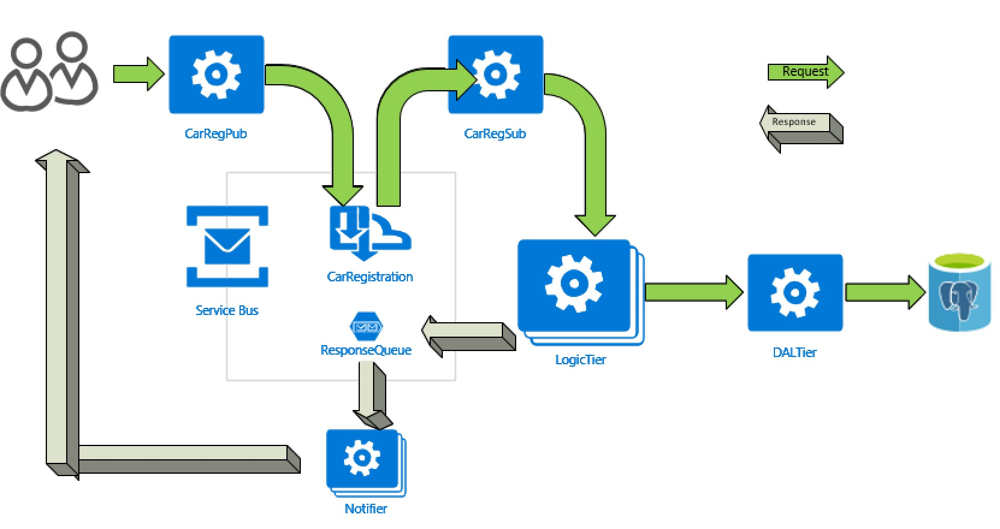

# azure-springboot-with-sb
## 1. Architectural Diagram


## 2. Pre-requisites/Azure Platform setup
- Create a namespace called 'car-registry' by applying [deploymentconfigtemplate/1.namespace.json](deploymentconfigtemplate/1.namespace.json).

- Setup a Azure Postgresql server and create mydb DB inside. And, after base64 encoding your crendential (both user name and password), add a new login account with a password to share with the datatier app. Update [deploymentconfigtemplate/2.postressql-endpoint.yml](deploymentconfigtemplate/2.postressql-endpoint.yml) and [deploymentconfigtemplate/3.postgres-secret.yml](deploymentconfigtemplate/3.postgres-secret.yml) file with your instance. Apply the yaml to your kubernetes cluster.
- Setup a Azure Service bus. And, create one topic with a subscription, and create a SAS account. Update [deploymentconfigtemplate/5.topicsb-secret.yml](deploymentconfigtemplate/5.topicsb-secret.yml) file with the topic and SAS connection string. Apply the yaml to your kubernetes cluster.
- Create one queue in the same Azure Service Bus and create an another SAS account for this queue. Update [deploymentconfigtemplate/4.outputqueue-secret.yml](deploymentconfigtemplate/4.outputqueue-secret.yml) file with the queue name and SAS connection string. Apply the yaml to your kubernetes cluster.

## 3. Deployment on OCP (Openshift Cloud Platform)
- for each microservice project folder:
  - cd to the microservice folder
  - test build locally
  ```sh
  mvn clean pakcage -DskipTests
  ```
  - set the OC credential
  ```sh
  oc login https://XXXX.westus.cloudapp.azure.com --token=YYYYYY
  ```
  - mvn command to build and deploy with fabic8-maven-plugin
  ```sh
  mvn clean package fabric8:build fabric8:resource fabric8:deploy -DskipTests -Pocp
  ```

## 4. Deployment on Azure Kubernetes Service(AKS) 
- for each microservice project folder:
  - cd to the microservice folder
  - test build locally
  ```sh
  mvn clean pakcage -DskipTests
  ```
  - set the AKS credential
  ```sh
  az acr login --name $YOUR_ACR_NAME
  ```
  - mvn command to build with fabic8-maven-plugin. Override 'docker.image.prefix' with your acr login server.
  ```sh
  mvn clean package fabric8:build -Paks  -DskipTests -Ddocker.image.prefix=${YOUR_ACR_LOGIN_SERVER}
  ```
  - Push the image generated from the previous step. Use the version number suffix from the build
  ```sh
  docker push ${YOUR_ACR_LOGIN_SERVER}/${IMAGENAME}:${VERSION}
  ```
  - mvn command to build fabic8-maven-plugin. Override 'docker.image.prefix' with your acr login server.
  ```sh
  mvn fabric8:resource fabric8:deploy -Paks  -DskipTests -Ddocker.image.prefix=${YOUR_ACR_LOGIN_SERVER}
  ```
